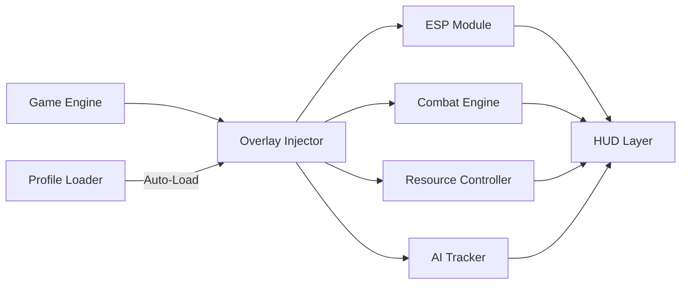

# Lessaria Trainer ⚔️

Step beyond limits in **Lessaria**, the acclaimed fantasy RPG, with the **Lessaria Trainer** — a refined, feature-rich control system crafted for players who want **performance, insight, and precision**. This standalone Windows tool enhances your gameplay through real-time overlays, quick stat adjustments, and environmental awareness — while preserving story integrity and immersion.

Whether you’re optimizing combat builds or exploring every hidden cavern, the Lessaria Trainer helps you move smarter, strike faster, and survive longer.

---

## 🧭 Overview

Unlike traditional cheats, the Trainer uses a **non-invasive overlay injection** method — meaning no core file modification or risk of data corruption. All modules operate externally, reading live data from the game’s render layer to provide **real-time stat visualization**, **AI awareness**, and **tunable combat parameters**.

It’s the perfect companion for players who want control without compromise.

---

## ⚔️ Key Features

* **👁 ESP Tracker:** Visualize enemies, chests, crafting nodes, and quest NPCs through terrain.
* **💨 Infinite Stamina Mode:** Explore and battle endlessly without fatigue.
* **🧠 AI Awareness HUD:** View detection radii and aggression states of nearby foes.
* **🪄 Resource Manager:** Adjust gold, mana, or crafting materials instantly.
* **⚙️ Combat Tweaker:** Control attack speed, dodge cooldown, and block timing precision.
* **📜 Quest Overlay:** Track objectives dynamically, including hidden triggers and proximity alerts.
* **🗺 Map Fast-Travel:** Instantly warp between discovered locations for faster testing or exploration.

[!IMPORTANT]
Always use **Borderless Window Mode** before running the Trainer to ensure overlay accuracy and stable rendering.

---

## 🧠 Compatibility

| Platform        | Support | Notes                      |
| --------------- | ------- | -------------------------- |
| Windows 10      | ✅       | DX11 optimized             |
| Windows 11      | ✅       | DX12 supported             |
| Steam Edition   | ✅       | Auto-detect path           |
| Epic Edition    | ⚠️      | Manual attach required     |
| Vulkan Mode     | ⚠️      | Enable `--vk-hook=on` flag |
| Cloud Save Mode | ✅       | Fully compatible           |

> 💡 *Accessibility:* You can increase text size and contrast in the overlay’s “Visual” tab for nighttime or high-magic environments.

---

## ⚙️ Setup Guide

1. **Extract** the Trainer files into `C:\LessariaTrainer`.
2. **Launch the game** and wait until your character loads.
3. **Run the Trainer as Administrator:**

   ```bash
   LessariaTrainer.exe --inject --safe
   ```
4. **Open the overlay** in-game with **F10**.
5. Activate or tweak modules on-the-fly — stamina, ESP, AI, and combat.

**Example Command (Advanced Users):**

```bash
LessariaTrainer.exe --profile=Explorer --frametime-sync --dx=12
```

[!NOTE]
If overlay flickers, toggle `Alt+Enter` once to re-synchronize the draw pipeline.

---

## 🧩 Config Presets

**1. Balanced Combat (Default)**

```ini
[combat]
attack_speed=1.2
dodge_cooldown=0.8
stamina_reduction=0.7
block_timing=precise
```

**2. Explorer Mode**

```ini
[esp]
entity_outline=on
npc_color=#40BFFF
loot_color=#FFD700
map_markers=on
fog_density=0.4
```

**3. Wealth Runner**

```ini
[resources]
gold_addition=2500
crafting_drop_rate=2.0
inventory_capacity=unlimited
```

---

## 🗺 System Diagram



The modular architecture ensures every component (ESP, Combat, AI, Resource) runs asynchronously for maximum frame consistency and zero stutter — even during large-scale battles.

---

## 🧩 Advanced Options

| Flag               | Description                                   |
| ------------------ | --------------------------------------------- |
| `--safe`           | Secure, read-only overlay mode                |
| `--dx=12`          | Forces DirectX 12 mode                        |
| `--vk-hook=on`     | Enables Vulkan compatibility                  |
| `--frametime-sync` | Locks overlay frame pacing to engine tick     |
| `--eco`            | Reduces overlay frame rate for GPU efficiency |
| `--profile=NAME`   | Loads a saved `.lstcfg` configuration         |
| `--record=on`      | Logs overlay performance data for diagnostics |

[!WARNING]
Avoid enabling **ESP** and **Full AI Tracker** simultaneously on integrated GPUs — both are resource-heavy visual modules.

---

## ❓ FAQ

**Q1: Does the Trainer work online?**
A: It’s meant for **offline or solo campaign modes**. Multiplayer sessions are unsupported.

**Q2: Will it corrupt my saves?**
A: No. It operates externally, leaving save data untouched.

**Q3: How often is it updated?**
A: Every 2–3 weeks alongside Lessaria patch cycles.

**Q4: Can I remap hotkeys?**
A: Yes. All functions are customizable under Settings → Input.

**Q5: Is there a lightweight mode?**
A: Yes. Run with `--eco` to minimize GPU load while keeping core modules active.

---

## ⚔️ Recommended Profiles

* **Nightblade:** ESP on, Stamina Infinite, Aggro Radius Display enabled.
* **Explorer:** Map Markers, Fog Control, Fast-Travel, HUD Overlay only.
* **Wealth Runner:** Loot Multiplier and Resource Manager enabled.

Switch easily using:

```bash
LessariaTrainer.exe --profile=Nightblade
```

---

## 🌙 Final Thoughts

The **Lessaria Trainer** was built for mastery — giving every adventurer the ability to train, analyze, and optimize their experience. From battle timing to resource flow, this precision tool ensures the fantasy world feels smoother, faster, and more responsive than ever before.

See more. Act faster. Control your destiny in Lessaria.
